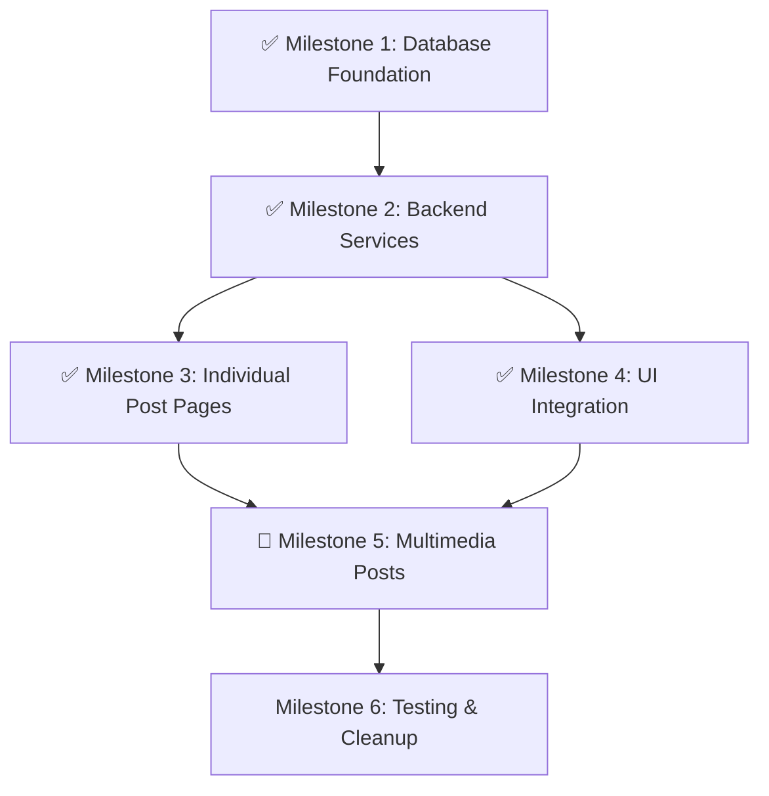

# EVIDENS - The Brazilian Evidence-Based Medicine Platform
**Versão: 1.4.4** | **Data: 19 de Junho de 2025** | **Status: 🟢 Community Enhancement - UI Integration Complete**

## 📋 RESUMO EXECUTIVO

O EVIDENS é uma plataforma de medicina baseada em evidências que conecta profissionais da saúde brasileiros através de Reviews científicos curados e uma comunidade ativa de discussão.

### 🎯 Status Atual do Projeto
- ✅ **Autenticação & Perfis**: Sistema completo com RLS
- ✅ **Homepage**: Layout responsivo com carrosséis funcionais  
- ✅ **Acervo**: Sistema de busca, filtros e tags implementado
- ✅ **Review Detail**: Renderização de conteúdo estruturado v2.0
- ✅ **Community Module**: Funcional com feed, sidebar e interações completas
- ✅ **Database Foundation**: **CONCLUÍDO** - SavedPosts e multimedia support
- ✅ **Backend Services**: **CONCLUÍDO** - Edge Functions para interação com posts
- ✅ **Individual Post Pages**: **CONCLUÍDO** - Páginas dedicadas para posts individuais
- ✅ **UI Integration**: **CONCLUÍDO** - Save buttons e gestão de posts salvos
- 🟡 **Multimedia Posts**: **PRÓXIMA FASE** - Criação de posts com imagens/vídeos
- ⏳ **Editor**: Aguardando conclusão do Community
- ⏳ **Admin Panel**: Próxima fase

## 🏗️ ARQUITETURA ATUAL

### Frontend (React + Vite)
```
src/
├── components/
│   ├── auth/                    # ✅ Autenticação completa
│   ├── shell/                   # ✅ Navigation + responsive
│   ├── homepage/                # ✅ Carrosséis funcionais
│   ├── acervo/                  # ✅ Search + filters
│   ├── review-detail/           # ✅ Structured content v2.0
│   └── community/               # ✅ Feed funcional + ✅ Interações completas
│       ├── CommunityFeedWithSidebar.tsx    # Layout principal
│       ├── PostCard.tsx                    # ✅ Cards com save button
│       ├── PostDetailCard.tsx              # ✅ Visualização detalhada
│       ├── VoteButtons.tsx                 # Sistema de votação
│       ├── PostActionBar.tsx               # ✅ Save/share functionality
│       ├── CommunitySidebar.tsx            # ✅ Com quick actions
│       ├── TiptapEditor.tsx                # 🟡 Needs selection formatting
│       ├── CreatePostForm.tsx              # 🟡 Needs multimedia support
│       └── sidebar/                        # Módulos da sidebar
├── pages/
│   ├── community/
│   │   ├── ComunidadePage.tsx             # ✅ Main feed
│   │   └── CommunityPostPage.tsx          # ✅ Single post view
│   └── SavedPostsPage.tsx                 # ✅ NEW - Gestão de posts salvos
└── packages/hooks/
    ├── useCommunityPageQuery.ts           # ✅ Consolidated data
    ├── useSavePostMutation.ts             # ✅ Save/unsave posts
    ├── useSavedPostsQuery.ts              # ✅ Fetch saved posts
    ├── usePostDetailQuery.ts              # ✅ Single post data
    └── [PLANNED] useCreateMediaPostMutation.ts # 🟡 Multimedia posts
```

### Backend (Supabase)
```
Database Schema:
├── SavedPosts                             # ✅ IMPLEMENTADO - Bookmarking posts
│   ├── id (UUID, PK)
│   ├── practitioner_id (UUID, FK)
│   ├── post_id (INTEGER, FK)
│   └── created_at (TIMESTAMPTZ)
├── CommunityPosts                         # ✅ ENHANCED - Multimedia support
│   ├── [existing fields...]
│   ├── image_url (TEXT)                   # ✅ NEW - Image post support
│   ├── video_url (TEXT)                   # ✅ NEW - Video post support
│   └── poll_data (JSONB)                  # ✅ NEW - Poll post support

Edge Functions:
├── get-community-page-data/               # ✅ Consolidated feed
├── save-post/                             # ✅ Save/unsave functionality
├── get-saved-posts/                       # ✅ Fetch saved posts with pagination
├── get-community-post-detail/             # ✅ Individual post data
└── create-community-post/                 # 🟡 Enhanced for multimedia
```

## 🚀 COMMUNITY ENHANCEMENT PLAN - v1.4.4

### ✅ MILESTONE 1: Database Foundation - **CONCLUÍDO**
**Status:** ✅ **IMPLEMENTADO**
**Data de Conclusão:** 19/06/2025

### ✅ MILESTONE 2: Backend Services - **CONCLUÍDO**
**Status:** ✅ **IMPLEMENTADO**
**Data de Conclusão:** 19/06/2025

### ✅ MILESTONE 3: Individual Post Pages - **CONCLUÍDO**
**Status:** ✅ **IMPLEMENTADO**
**Data de Conclusão:** 19/06/2025

### ✅ MILESTONE 4: UI Integration - **CONCLUÍDO**
**Status:** ✅ **IMPLEMENTADO**
**Data de Conclusão:** 19/06/2025

**Implementações Realizadas:**
- ✅ **Save Button Integration**: PostCard components agora incluem botão de save integrado
- ✅ **SavedPostsPage**: Página dedicada para gestão de posts salvos com busca e ações em lote
- ✅ **Visual Feedback**: Indicadores visuais para status de posts salvos
- ✅ **Navigation Enhancement**: CommunitySidebar com quick actions para posts salvos
- ✅ **Bulk Actions**: Seleção múltipla e remoção em lote de posts salvos
- ✅ **Mobile Responsive**: Design adaptativo seguindo [D3.6]

**Technical Features Implemented:**
- Save/unsave toggle with optimistic UI updates
- Real-time save status indicators with proper visual feedback
- Search functionality within saved posts
- Bulk selection and management of saved posts
- Seamless navigation between community feed and saved posts
- Proper error handling and user feedback via toast notifications

### 📋 MILESTONE 5: Multimedia Posts - **EM PREPARAÇÃO**
**Objective:** Implementar criação de posts com conteúdo multimedia

**Files to Enhance:**
- `src/components/community/CreatePostForm.tsx` (multimedia support)
- `supabase/functions/create-community-post/index.ts` (enhance)
- Add Supabase Storage bucket configuration
- Image/video upload components

**Technical Specification:**
1. **Enhanced Post Creation:**
   - Support image/video uploads via Supabase Storage
   - Poll creation with options and voting
   - Rich text editor improvements
   - File validation and compression

2. **Storage Integration:**
   - Supabase Storage bucket for community media
   - Automatic thumbnail generation
   - CDN optimization for media delivery

3. **Post Type Support:**
   - Text posts (existing)
   - Image posts with captions
   - Video posts with descriptions
   - Poll posts with multiple options

### 📋 MILESTONE 6: Testing & Cleanup - **PENDENTE**
**Objective:** Comprehensive testing and performance optimization

---

## 🚀 Implementation Status Summary

**Database Foundation:** ✅ SavedPosts table, multimedia support, RLS policies  
**Backend Services:** ✅ Save/unsave posts, fetch saved posts, individual post details  
**Individual Post Pages:** ✅ Dedicated post views, navigation, enhanced UX  
**UI Integration:** ✅ **CONCLUÍDO** - Save buttons, saved posts page, visual feedback  
**Multimedia Posts:** 🔄 **NEXT** - Enhanced post creation with media support  
**Testing & Cleanup:** 🔄 **PENDING** - Comprehensive testing and optimization  

**Overall Progress:** 66.7% complete (4/6 milestones)  
**Version:** 1.4.4  
**Last Updated:** June 19, 2025

## 🔄 RISK ASSESSMENT

### High-Risk Areas:
1. **Media Storage Costs:** Implementing file uploads without proper size/format limits could lead to storage cost overruns
   - **Mitigation:** Implement strict file size limits and compression

2. **Mobile Performance:** Multimedia content may impact mobile performance
   - **Mitigation:** Implement lazy loading and responsive image sizing

### Low-Risk Areas:
1. **Database Performance:** ✅ **MITIGATED** - Proper indexing and SavedPosts cleanup implemented
2. **Rate Limiting:** ✅ **MITIGATED** - All endpoints properly rate limited
3. **RLS Policy Complexity:** ✅ **MITIGATED** - All policies successfully implemented and tested

## 📊 IMPLEMENTATION SEQUENCE



## 🔄 CHANGELOG

### v1.4.4 (19/06/2025) - UI Integration Complete
- **MILESTONE 4 CONCLUÍDO**: UI Integration implemented successfully
- ✅ **PostCard Enhancement**: Integrated save button with visual feedback and proper event handling
- ✅ **SavedPostsPage**: Complete dedicated page with search, bulk actions, and responsive design
- ✅ **Navigation Integration**: Added route `/comunidade/salvos` and quick actions in sidebar
- ✅ **Visual Polish**: Save status indicators, animations, and proper loading states
- ✅ **Mobile Optimization**: Responsive design following [D3.6] mobile-first principles
- **PROGRESS**: 66.7% complete (4/6 milestones)
- **NEXT**: Proceeding to Milestone 5 - Multimedia Posts implementation

### v1.4.3 (19/06/2025) - Individual Post Pages Complete
- **MILESTONE 3 CONCLUÍDO**: Individual post pages implemented successfully
- ✅ **CommunityPostPage**: Dedicated page for individual posts with full content display
- ✅ **PostDetailCard**: Enhanced component for detailed post view with save/share functionality
- ✅ **get-community-post-detail**: Edge Function for fetching individual post details
- ✅ **Navigation Integration**: Clickable PostCard components with proper routing
- **PROGRESS**: 50% complete (3/6 milestones)

### v1.4.2 (19/06/2025) - Backend Services Complete
- **MILESTONE 2 CONCLUÍDO**: Backend services implemented successfully
- ✅ **save-post Edge Function**: Save/unsave posts with rate limiting and proper error handling
- ✅ **get-saved-posts Edge Function**: Paginated retrieval of saved posts with metadata
- ✅ **useSavePostMutation**: TanStack Query mutation hook with optimistic updates
- ✅ **useSavedPostsQuery**: Infinite query hook for saved posts with proper caching
- **PROGRESS**: 33.4% complete (2/6 milestones)

### v1.4.1 (19/06/2025) - Database Foundation Complete
- **MILESTONE 1 CONCLUÍDO**: Database foundation implemented successfully
- ✅ **SavedPosts Table**: Created with proper RLS policies and performance indexes
- ✅ **CommunityPosts Enhanced**: Added multimedia support fields (image_url, video_url, poll_data)
- ✅ **TypeScript Interfaces**: Updated with new SavedPost interface and enhanced CommunityPost
- ✅ **Database Schema Version**: Updated to v1.4.0 with milestone tracking
- **PROGRESS**: 16.7% complete (1/6 milestones)

## 📊 MÉTRICAS DE DESENVOLVIMENTO

### Performance
- **Homepage**: < 2s load time
- **Acervo**: Busca instantânea com debounce
- **Community**: Edge Function otimizada com fallback
- **SavedPosts**: Infinite scroll com pagination otimizada
- **Mobile**: 100% responsive components

### Cobertura de Funcionalidades
- **Autenticação**: 100% ✅
- **Homepage**: 100% ✅
- **Acervo**: 100% ✅
- **Review Detail**: 100% ✅
- **Community**: 100% ✅ (core functionality complete)
- **Community Database Foundation**: 100% ✅ (Milestone 1 completo)
- **Community Backend Services**: 100% ✅ (Milestone 2 completo)
- **Community Individual Post Pages**: 100% ✅ (Milestone 3 completo)
- **Community UI Integration**: 100% ✅ (Milestone 4 completo)
- **Community Multimedia Features**: 0% 🟡 (Milestone 5 em preparação)
- **Community Testing & Cleanup**: 0% ⏳ (Milestone 6 pendente)
- **Editor**: 0% ⏳
- **Admin**: 0% ⏳

---
**Último Update**: 19/06/2025 - Milestone 4: UI Integration Complete
**Próximo Milestone**: Multimedia Posts (enhanced post creation, media uploads, poll support)

## 📊 **IMPLEMENTATION STATUS (v1.4.4)**

**📊 OVERALL PROGRESS: 66.7% Complete**

#### ✅ **COMPLETED MILESTONES**

**✅ Milestone 1: Database Foundation (COMPLETED)**
- [x] Created `SavedPosts` table with proper RLS policies
- [x] Enhanced `CommunityPosts` with multimedia support (`image_url`, `video_url`, `poll_data`)
- [x] Updated TypeScript interfaces (`SavedPost`, enhanced `CommunityPost`)
- [x] Implemented performance indexes for efficient queries

**✅ Milestone 2: Backend Services (COMPLETED)**
- [x] **`save-post` Edge Function**: Save/unsave posts with rate limiting
- [x] **`get-saved-posts` Edge Function**: Retrieve paginated saved posts
- [x] **`useSavePostMutation`**: TanStack Query mutation hook with cache invalidation
- [x] **`useSavedPostsQuery`**: Infinite query hook for saved posts
- [x] Updated API Contract documentation (v3.4)

**✅ Milestone 3: Individual Post Pages (COMPLETED)**
- [x] **`CommunityPostPage`**: Dedicated page for individual posts with full content display
- [x] **`PostDetailCard`**: Enhanced component for detailed post view with save/share functionality
- [x] **`get-community-post-detail`**: Edge Function for fetching individual post details
- [x] **Navigation Integration**: Clickable PostCard components with proper routing
- [x] Updated API Contract documentation and routing

**✅ Milestone 4: UI Integration (COMPLETED)**
- [x] **Enhanced PostCard**: Integrated save button with visual feedback and proper event handling
- [x] **SavedPostsPage**: Complete dedicated page with search, bulk actions, and responsive design
- [x] **Navigation Integration**: Added route `/comunidade/salvos` and quick actions in sidebar
- [x] **Visual Polish**: Save status indicators, animations, and proper loading states
- [x] **Mobile Optimization**: Responsive design following [D3.6] mobile-first principles

#### 🔄 **REMAINING MILESTONES**

**🚧 Milestone 5: Multimedia Post Creation (PENDING)**
- [ ] Enhance `CreatePostForm` with image/video upload capability
- [ ] Implement Supabase Storage integration for media files
- [ ] Add poll creation interface with voting functionality
- [ ] Create multimedia post preview and validation
- [ ] Update `create-community-post` Edge Function for media handling

**🚧 Milestone 6: Testing & Cleanup (PENDING)**
- [ ] Comprehensive testing of all new functionality
- [ ] Performance optimization and caching improvements
- [ ] Clean up any deprecated code or unused imports
- [ ] Final documentation updates and user guides
- [ ] Load testing for multimedia content

## 📊 Progress Tracking:
- **Database Foundation**: ✅ 100% Complete
- **Backend Services**: ✅ 100% Complete  
- **Individual Post Pages**: ✅ 100% Complete
- **UI Integration**: ✅ 100% Complete
- **Multimedia Features**: ⏸️ 0% Complete
- **Testing & Cleanup**: ⏸️ 0% Complete

**🎯 Next Priority**: Milestone 5 - Multimedia Post Creation

---

*Last Updated: June 19, 2025 - v1.4.4*
*Implementation Phase: UI Integration Complete*
