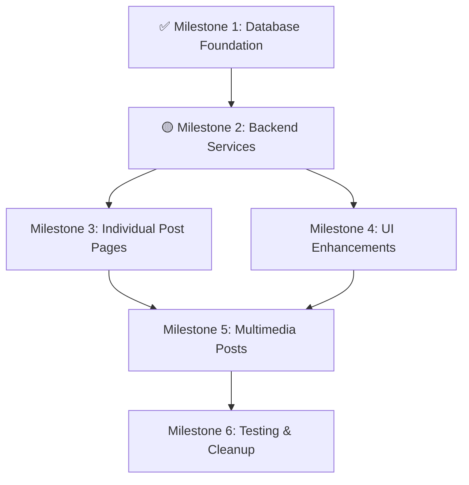

# EVIDENS - The Brazilian Evidence-Based Medicine Platform
**Versão: 1.4.1** | **Data: 19 de Junho de 2025** | **Status: 🟡 Em Desenvolvimento (Community Enhancement Plan)**

## 📋 RESUMO EXECUTIVO

O EVIDENS é uma plataforma de medicina baseada em evidências que conecta profissionais da saúde brasileiros através de Reviews científicos curados e uma comunidade ativa de discussão.

### 🎯 Status Atual do Projeto
- ✅ **Autenticação & Perfis**: Sistema completo com RLS
- ✅ **Homepage**: Layout responsivo com carrosséis funcionais  
- ✅ **Acervo**: Sistema de busca, filtros e tags implementado
- ✅ **Review Detail**: Renderização de conteúdo estruturado v2.0
- ✅ **Community Module**: Funcional com feed e sidebar
- ✅ **Database Foundation**: **CONCLUÍDO** - SavedPosts e multimedia support
- 🟡 **Backend Services**: **PRÓXIMA FASE** - Edge Functions para interação com posts
- ⏳ **Individual Post Pages**: Aguardando backend services
- ⏳ **UI Enhancements**: Aguardando backend services
- ⏳ **Editor**: Aguardando conclusão do Community
- ⏳ **Admin Panel**: Próxima fase

## 🏗️ ARQUITETURA ATUAL

### Frontend (React + Vite)
```
src/
├── components/
│   ├── auth/                    # ✅ Autenticação completa
│   ├── shell/                   # ✅ Navigation + responsive
│   ├── homepage/                # ✅ Carrosséis funcionais
│   ├── acervo/                  # ✅ Search + filters
│   ├── review-detail/           # ✅ Structured content v2.0
│   └── community/               # ✅ Feed funcional + 🟡 Melhorias em andamento
│       ├── CommunityFeedWithSidebar.tsx    # Layout principal
│       ├── PostCard.tsx                    # Cards de posts
│       ├── VoteButtons.tsx                 # Sistema de votação
│       ├── PostActionBar.tsx               # 🟡 Needs save functionality
│       ├── TiptapEditor.tsx                # 🟡 Needs selection formatting
│       ├── CreatePostForm.tsx              # 🟡 Needs multimedia support
│       ├── sidebar/                        # Módulos da sidebar
│       └── [PLANNED] PostDetailPage.tsx   # 🟡 Individual post pages
├── pages/
│   ├── community/
│   │   ├── ComunidadePage.tsx             # ✅ Main feed
│   │   └── [PLANNED] PostPage.tsx        # 🟡 Single post view
└── packages/hooks/
    ├── useCommunityPageQuery.ts           # ✅ Consolidated data
    ├── [PLANNED] useSavePostMutation.ts   # 🟡 Save/unsave posts
    ├── [PLANNED] usePostDetailQuery.ts    # 🟡 Single post data
    └── [PLANNED] useCreateMediaPostMutation.ts # 🟡 Multimedia posts
```

### Backend (Supabase)
```
Database Schema:
├── SavedPosts                             # ✅ IMPLEMENTADO - Bookmarking posts
│   ├── id (UUID, PK)
│   ├── practitioner_id (UUID, FK)
│   ├── post_id (INTEGER, FK)
│   └── created_at (TIMESTAMPTZ)
├── CommunityPosts                         # ✅ ENHANCED - Multimedia support
│   ├── [existing fields...]
│   ├── image_url (TEXT)                   # ✅ NEW - Image post support
│   ├── video_url (TEXT)                   # ✅ NEW - Video post support
│   └── poll_data (JSONB)                  # ✅ NEW - Poll post support

Edge Functions:
├── get-community-page-data/               # ✅ Consolidated feed
├── [PLANNED] save-post/                   # 🟡 Save/unsave functionality
├── [PLANNED] get-post-detail/             # 🟡 Individual post data
└── create-community-post/                 # 🟡 Enhanced for multimedia
```

## 🚀 COMMUNITY ENHANCEMENT PLAN - v1.4.1

### ✅ MILESTONE 1: Database Foundation - **CONCLUÍDO**
**Status:** ✅ **IMPLEMENTADO**
**Data de Conclusão:** 19/06/2025

**Implementações Realizadas:**
- ✅ Tabela `SavedPosts` criada com RLS policies
- ✅ Campos multimedia adicionados à tabela `CommunityPosts`
- ✅ Indexes de performance implementados
- ✅ TypeScript interfaces atualizadas
- ✅ Suporte para post types: text, image, video, poll

**Technical Details:**
- SavedPosts table with proper foreign keys and unique constraints
- RLS policies allowing users to manage their saved posts only
- CommunityPosts enhanced with image_url, video_url, poll_data fields
- Updated TypeScript interfaces for SavedPost, enhanced CommunityPost
- New form types for multimedia post creation

### 📋 MILESTONE 2: Backend Services - **EM PREPARAÇÃO**
**Objective:** Implementar server-side logic para interação com posts

**Files to Create/Modify:**
- `supabase/functions/save-post/index.ts`
- `supabase/functions/get-post-detail/index.ts`
- `supabase/functions/create-community-post/index.ts` (enhance)

**Technical Specification:**
1. **Save/Unsave Post Function:**
   - Rate limited: 20 req/min per user
   - Toggle saved state for authenticated users
   - Return updated saved status

2. **Post Detail Function:**
   - Fetch individual post with full metadata
   - Include author details and interaction counts
   - Support for multimedia content rendering

3. **Enhanced Post Creation:**
   - Support image/video uploads via Supabase Storage
   - Poll creation with options
   - Validation for multimedia content types

**Governing Directives:** [SEC.2], [SEC.3], [DAL.2], [DAL.3]

**Verification Criteria:**
- [ ] Save/unsave toggles correctly for authenticated users
- [ ] Post detail returns complete post data structure
- [ ] Multimedia posts create successfully with proper validation
- [ ] All functions include proper error handling and CORS

### 📋 MILESTONE 3: Individual Post Pages
**Objective:** Create dedicated pages for individual post viewing

**Files to Create:**
- `src/pages/community/PostPage.tsx`
- `src/components/community/PostDetail.tsx`
- `packages/hooks/usePostDetailQuery.ts`

**Technical Specification:**
1. **Routing Setup:**
   - Route: `/comunidade/post/[postId]`
   - Dynamic parameter extraction
   - 404 handling for non-existent posts

2. **Post Detail Component:**
   - Full post content display
   - Author information and metadata
   - Voting and action buttons
   - Placeholder for comments (future implementation)

3. **Data Fetching Hook:**
   - TanStack Query integration
   - Error handling and loading states
   - Cache invalidation on post updates

**Governing Directives:** [D3.2], [AD.1], [DAL.1]

**Verification Criteria:**
- [ ] Individual post URLs work correctly
- [ ] Post detail page renders all content properly
- [ ] Mobile-responsive layout implemented
- [ ] Loading and error states handled gracefully

### 📋 MILESTONE 4: UI Enhancements
**Objective:** Update existing components with new functionality

**Files to Modify:**
- `src/components/community/PostActionBar.tsx`
- `src/components/community/PostCard.tsx`
- `src/components/community/TiptapEditor.tsx`
- `packages/hooks/useSavePostMutation.ts` (new)

**Technical Specification:**
1. **PostActionBar Updates:**
   - Remove "Responder" text label
   - Add functional save/bookmark button
   - Reposition buttons for better UX
   - Add click handler for post navigation

2. **TiptapEditor Enhancements:**
   - Selection-based formatting (bold, italic, lists)
   - Prevent block-level formatting from affecting entire content
   - Improved toolbar responsiveness

3. **Save Post Functionality:**
   - Optimistic UI updates
   - Error handling with rollback
   - Visual feedback for saved state

**Governing Directives:** [AD.2], [D3.3], [DAL.4]

**Verification Criteria:**
- [ ] Save button functions correctly with visual feedback
- [ ] Text formatting applies only to selected text
- [ ] Post cards link to individual post pages
- [ ] All interactions work on mobile devices

### 📋 MILESTONE 5: Multimedia Post Creation
**Objective:** Extend post creation to support images, videos, and polls

**Files to Modify:**
- `src/components/community/CreatePostForm.tsx`
- `src/components/community/MediaUpload.tsx` (new)
- `src/components/community/PollCreator.tsx` (new)
- `packages/hooks/useCreateMediaPostMutation.ts` (new)

**Technical Specification:**
1. **Post Type Selection:**
   - Radio buttons: Text, Image, Video, Poll
   - Conditional form rendering based on selection
   - Validation rules per post type

2. **Media Upload Component:**
   - Drag-and-drop file upload
   - Image/video preview
   - File type and size validation
   - Progress indicators

3. **Poll Creator:**
   - Dynamic option management (add/remove)
   - Minimum 2 options, maximum 10
   - Option text validation

**Governing Directives:** [D3.1], [D3.2], [SEC.1]

**Verification Criteria:**
- [ ] All post types create successfully
- [ ] Media uploads work with proper validation
- [ ] Polls display correctly in feed
- [ ] Form validation prevents invalid submissions

### 📋 MILESTONE 6: Testing & Cleanup
**Objective:** Comprehensive testing and code cleanup

**Files to Review/Cleanup:**
- Remove placeholder toast messages
- Update loading states across components
- Performance testing for multimedia content
- Mobile responsiveness verification

**Technical Specification:**
1. **Integration Testing:**
   - End-to-end post creation flows
   - Save/unsave functionality across devices
   - Media post rendering verification

2. **Performance Optimization:**
   - Image lazy loading
   - Query optimization for post details
   - Bundle size analysis

3. **Code Cleanup:**
   - Remove placeholder implementations
   - Consolidate duplicate code
   - Update error messages

**Governing Directives:** [P1.3], [AD.4]

**Verification Criteria:**
- [ ] All placeholder functionality removed
- [ ] Performance metrics meet standards
- [ ] Code coverage adequate for new features
- [ ] Documentation updated

## 🔄 RISK ASSESSMENT

### High-Risk Areas:
1. **Media Storage Costs:** Implementing file uploads without proper size/format limits could lead to storage cost overruns
   - **Mitigation:** Implement strict file size limits and compression

2. **Database Performance:** SavedPosts table could grow large quickly
   - **Mitigation:** ✅ **MITIGATED** - Proper indexing implemented and periodic cleanup planned

3. **Mobile Performance:** Multimedia content may impact mobile performance
   - **Mitigation:** Implement lazy loading and responsive image sizing

### Medium-Risk Areas:
1. **Rate Limiting:** New endpoints need proper rate limiting to prevent abuse
2. **RLS Policy Complexity:** ✅ **MITIGATED** - SavedPosts RLS policies successfully implemented
3. **Editor Complexity:** Advanced text selection features may conflict with existing functionality

## 📊 IMPLEMENTATION SEQUENCE



## 🔄 CHANGELOG

### v1.4.1 (19/06/2025) - Database Foundation Complete
- **MILESTONE 1 CONCLUÍDO**: Database foundation implemented successfully
- ✅ **SavedPosts Table**: Created with proper RLS policies and performance indexes
- ✅ **CommunityPosts Enhanced**: Added multimedia support fields (image_url, video_url, poll_data)
- ✅ **TypeScript Interfaces**: Updated with new SavedPost interface and enhanced CommunityPost
- ✅ **Database Schema Version**: Updated to v1.4.0 with milestone tracking
- **NEXT**: Proceeding to Milestone 2 - Backend Services implementation

### v1.4.0 (19/06/2025) - Community Enhancement Plan
- **PLANNING**: Comprehensive implementation plan for post interaction system
- Defined 6 milestones for systematic feature rollout
- Identified risk areas and mitigation strategies
- Established database schema requirements for SavedPosts and multimedia support

### v1.3.2 (19/06/2025) - CORS Fix
- **CRÍTICO**: Corrigido CORS headers no Edge Function `get-community-page-data`
- Melhorado tratamento de OPTIONS requests
- Parsing robusto de request body
- Headers de resposta padronizados

### v1.3.1 (19/06/2025) - Community Types Fix
- Corrigidos erros de compilação TypeScript
- Interfaces `CommunityPost` padronizadas
- Import paths corrigidos

### v1.3.0 (19/06/2025) - Community Consolidation
- Implementação da arquitetura consolidada do Community
- Hook `useCommunityPageQuery` com dados unificados
- Sidebar completa com módulos funcionais
- Rate limiting implementado globalmente

## 📊 MÉTRICAS DE DESENVOLVIMENTO

### Performance
- **Homepage**: < 2s load time
- **Acervo**: Busca instantânea com debounce
- **Community**: Edge Function otimizada com fallback
- **Mobile**: 100% responsive components

### Cobertura de Funcionalidades
- **Autenticação**: 100% ✅
- **Homepage**: 100% ✅
- **Acervo**: 100% ✅
- **Review Detail**: 100% ✅
- **Community**: 95% ✅ (base funcional)
- **Community Database Foundation**: 100% ✅ (Milestone 1 completo)
- **Community Backend Services**: 0% 🟡 (Milestone 2 em preparação)
- **Community UI Enhancements**: 0% ⏳ (aguardando backend)
- **Editor**: 0% ⏳
- **Admin**: 0% ⏳

---
**Último Update**: 19/06/2025 - Milestone 1: Database Foundation Complete
**Próximo Milestone**: Backend Services (save-post, get-post-detail, enhanced create-post)


## 📊 **IMPLEMENTATION STATUS (v1.4.2)**

**📊 OVERALL PROGRESS: 33.4% Complete**

#### ✅ **COMPLETED MILESTONES**

**✅ Milestone 1: Database Foundation (COMPLETED)**
- [x] Created `SavedPosts` table with proper RLS policies
- [x] Enhanced `CommunityPosts` with multimedia support (`image_url`, `video_url`, `poll_data`)
- [x] Updated TypeScript interfaces (`SavedPost`, enhanced `CommunityPost`)
- [x] Implemented performance indexes for efficient queries

**✅ Milestone 2: Backend Services (COMPLETED)**
- [x] **`save-post` Edge Function**: Save/unsave posts with rate limiting
- [x] **`get-saved-posts` Edge Function**: Retrieve paginated saved posts
- [x] **`useSavePostMutation`**: TanStack Query mutation hook with cache invalidation
- [x] **`useSavedPostsQuery`**: Infinite query hook for saved posts
- [x] Updated API Contract documentation (v3.4)

#### 🔄 **IN PROGRESS**

**🚧 Milestone 3: Individual Post Pages (PENDING)**
- [ ] Create `/comunidade/[postId]` route component
- [ ] Implement `PostDetailPage` with full post content
- [ ] Add breadcrumb navigation and sharing functionality
- [ ] Integrate save/unsave functionality in post detail view

**🚧 Milestone 4: UI Enhancements (PENDING)**
- [ ] Add save/bookmark buttons to `PostCard` components
- [ ] Create saved posts management page
- [ ] Implement save status indicators and animations
- [ ] Add bulk actions for saved posts management

**🚧 Milestone 5: Multimedia Post Creation (PENDING)**
- [ ] Enhance `CreatePostForm` with image/video upload
- [ ] Implement poll creation interface
- [ ] Add rich text editor with media embedding
- [ ] Create multimedia post preview functionality

**🚧 Milestone 6: Testing & Cleanup (PENDING)**
- [ ] Comprehensive testing of all new functionality
- [ ] Performance optimization and caching improvements
- [ ] Clean up any deprecated code or unused imports
- [ ] Final documentation updates and user guides

## 📊 Progress Tracking:
- **Database Foundation**: ✅ 100% Complete
- **Backend Services**: ✅ 100% Complete  
- **Individual Post Pages**: ⏸️ 0% Complete
- **UI Enhancements**: ⏸️ 0% Complete
- **Multimedia Features**: ⏸️ 0% Complete
- **Testing & Cleanup**: ⏸️ 0% Complete

**🎯 Next Priority**: Milestone 3 - Individual Post Pages

---

*Last Updated: June 19, 2025 - v1.4.2*
*Implementation Phase: Backend Services Complete*
