# **📋 EVIDENS Implementation Plan: Core Application Stabilization (REVISED)**

**Version:** 6.1 (Risk-Mitigated)  
**Date:** June 19, 2025  
**Status:** 🟢 Ready for Constrained Implementation  
**Author:** Senior Systems Architect  
**Audit:** Risk-Mitigated per Senior Systems Architect Review

---

## **🎯 EXECUTIVE SUMMARY & STRATEGIC ALIGNMENT**

### **Primary Objective**
Transform the current functional EVIDENS application into a **stable, feature-complete platform** by implementing missing core interactions through **strictly constrained, additive changes**. This plan prioritizes **functional completeness with zero architectural risk**.

### **Critical Implementation Constraints**
This plan has been audited and revised to eliminate all identified sources of scope creep and complexity. The following constraints are **NON-NEGOTIABLE**:

1. **Strictly Additive UI Changes**: No refactoring or restyling of existing components
2. **No Draft Functionality**: Single-submission workflow only
3. **Minimal Tiptap Extensions**: StarterKit only, no additional extensions
4. **Sequential Milestone Execution**: Complete verification before proceeding
5. **Stability Over Performance**: No optimistic updates or complex optimizations

---

## **🚀 MILESTONE 1: CORE INTERACTION PARITY**
*Estimated Duration: 3-4 implementation cycles*

### **Objective**
Enable all post-related user interactions currently supported by the backend but missing from the UI through **strictly additive changes only**.

---

### **TASK 1.1: Community Post Actions Data Layer**

**Priority:** CRITICAL  
**Governing Directives:** [DAL.1], [DAL.2], [DAL.3], [DAL.4]

#### **CRITICAL CONSTRAINT: Simplicity Over Performance**
**MANDATORY SIMPLIFICATION**: Do not implement optimistic updates. Use only `queryClient.invalidateQueries` for cache management. This constraint is non-negotiable for stability.

#### **Technical Specifications**

**File Creation:**
- `packages/hooks/usePostActionMutation.ts`

**Implementation Requirements:**
```typescript
// Mandatory Hook Interface
interface PostActionPayload {
  postId: number;
  action: 'delete' | 'pin' | 'unpin' | 'lock' | 'unlock';
}

interface PostActionResponse {
  success: boolean;
  message: string;
}
```

**Backend Integration:**
- Use existing `handle_post_action` RPC function only
- Implement standard error handling (no advanced retry logic)
- **MANDATORY**: Use `queryClient.invalidateQueries({ queryKey: ['community-feed'] })` on success

#### **Verification Criteria**
- [ ] Hook interfaces correctly with `handle_post_action` RPC
- [ ] Standard error handling implemented
- [ ] Cache invalidation triggers immediate UI updates
- [ ] No optimistic updates or complex cache manipulations

---

### **TASK 1.2: Post Interaction UI Components**

**Priority:** HIGH  
**Governing Directives:** [D3.2.1], [SEC.2], [AD.2]

#### **CRITICAL CONSTRAINT: Strictly Additive Changes**
**MANDATORY RESTRICTION**: Modifications to `PostCard.tsx` must be strictly additive. You are explicitly forbidden from refactoring, restyling, or altering the existing CSS or layout structure. The goal is functional completion, not visual redesign.

#### **Component Architecture**

**New Components to Create:**

1. **`src/components/community/PostActionMenu.tsx`**
   - Dropdown menu with contextual actions only
   - Role-based visibility using `useAuthStore`
   - No styling changes to parent components

2. **`src/components/community/PostActionBar.tsx`**
   - Horizontal action bar: comment, share, save buttons
   - **SAVE BUTTON CONSTRAINT**: Implement as placeholder with toast message "Funcionalidade em breve"
   - Mobile-optimized touch targets (≥44px)

3. **`src/components/community/PostCard.tsx` (Modification)**
   - **STRICTLY ADDITIVE**: Add components to existing layout only
   - No changes to existing CSS classes or structure
   - No visual redesigns or "improvements"

#### **Permission Logic Implementation**
```typescript
// Simple role-based visibility (no complex permission systems)
const canModerate = user?.role === 'editor' || user?.role === 'admin';
const canDelete = post.author_id === user?.id || canModerate;
```

#### **Verification Criteria**
- [ ] Action menu appears with role-appropriate options
- [ ] Post deletion removes item from feed immediately
- [ ] Save button shows placeholder toast message
- [ ] **CRITICAL**: PostCard layout unchanged except for added components
- [ ] Mobile touch targets meet standards

---

## **🎨 MILESTONE 2: RICH CONTENT CREATION**
*Estimated Duration: 4-5 implementation cycles*

### **Objective**
Replace placeholder post creation with minimal viable rich text editor. **NO DRAFT FUNCTIONALITY** - single submission workflow only.

---

### **TASK 2.1: Post Submission Page Infrastructure**

**Priority:** HIGH  
**Governing Directives:** [D3.1.1], [D3.5], [AD.1]

#### **CRITICAL CONSTRAINT: No Draft Functionality**
**MANDATORY EXCLUSION**: You are explicitly forbidden from implementing any "draft functionality," "progress saving," or "auto-save" features. This represents massive scope creep and is completely out of scope.

#### **Routing Implementation**

**Files to Modify:**
- `src/App.tsx` - Add route only
- Navigation components - Update buttons to navigate to `/community/submit`

**Route Specification:**
```typescript
<Route path="/community/submit" element={
  <ProtectedAppRoute>
    <SubmitPage />
  </ProtectedAppRoute>
} />
```

#### **Page Component Creation**

**New File:** `src/pages/community/SubmitPage.tsx`

**Component Requirements:**
- Standard AppShell integration only
- Simple form container
- **NO DRAFT FEATURES**: Single submission workflow only
- **NO AUTO-SAVE**: Form resets on successful submission

#### **Verification Criteria**
- [ ] Route accessible and protected
- [ ] Navigation functions correctly
- [ ] **CRITICAL**: No draft or auto-save functionality implemented
- [ ] Simple, clean page layout

---

### **TASK 2.2: Rich Text Editor Implementation**

**Priority:** CRITICAL  
**Governing Directives:** [Blueprint 08a_EDITOR_BLUEPRINT], [D3.3], [DAL.2]

#### **CRITICAL CONSTRAINTS: Minimal Tiptap Implementation**

**MANDATORY EXTENSION RESTRICTION**: You are restricted to using only `@tiptap/starter-kit`. Do not add any other extensions. This constraint prevents bundle bloat and complexity.

**MANDATORY STYLING CONSTRAINT**: Use Tailwind's `@tailwindcss/typography` plugin with `prose` and `dark:prose-invert` classes. Do not use Tiptap's default CSS.

#### **Technology Stack**

**Dependencies to Add (ONLY THESE):**
- `@tiptap/react`
- `@tiptap/starter-kit`
- `@tiptap/extension-placeholder`

#### **Component Architecture**

**New Components:**

1. **`src/components/community/CreatePostForm.tsx`**
   - Form state via `react-hook-form`
   - Category selection
   - **TEXT POSTS ONLY** (no image/poll tabs)
   - Simple rich text content area

2. **`src/components/community/TiptapEditor.tsx`**
   - **STARTER-KIT ONLY**: Bold, Italic, Lists, Links, Headings
   - **NO ADDITIONAL EXTENSIONS**
   - Tailwind typography styling only

#### **Form State Management**
```typescript
// Simple form structure (no draft complexity)
interface PostFormData {
  title: string;
  category: string;
  content: JSONContent; // Tiptap JSON from StarterKit only
}
```

#### **Editor Configuration**
- **Toolbar**: Bold, Italic, Bullet List, Numbered List, Headings (H1-H3), Links only
- **Extensions**: StarterKit + Placeholder only
- **Styling**: `prose dark:prose-invert` classes
- **No Advanced Features**: No tables, mentions, custom nodes, or complex extensions

#### **Verification Criteria**
- [ ] Editor renders with StarterKit features only
- [ ] Rich text formatting preserved in database
- [ ] Form validation prevents invalid submissions
- [ ] **CRITICAL**: No extensions beyond StarterKit implemented
- [ ] Tailwind typography styling applied correctly

---

## **🔧 MILESTONE 3: STABILIZATION & POLISH**
*Estimated Duration: 2-3 implementation cycles*

### **Objective**
Resolve identified bugs and remove obsolete code with zero risk of introducing new issues.

---

### **TASK 3.1: Acervo Tag Sorting Algorithm Fix**

**Priority:** MEDIUM  
**Governing Directives:** [AD.3], [Blueprint 04_ACERVO_BLUEPRINT]

#### **Implementation**

**File to Modify:** `src/components/acervo/ClientSideSorter.tsx`

**Algorithm Specification:**
```typescript
const getTagPriority = (tag: Tag, selectedTags: number[]): number => {
  if (selectedTags.includes(tag.id)) return 1; // Selected
  if (tag.parent_id && selectedTags.includes(tag.parent_id)) return 2; // Child of selected
  return 3; // Other
};

// Sort by priority, then alphabetically
tags.sort((a, b) => {
  const priorityDiff = getTagPriority(a, selectedTags) - getTagPriority(b, selectedTags);
  return priorityDiff !== 0 ? priorityDiff : a.tag_name.localeCompare(b.tag_name);
});
```

#### **Verification Criteria**
- [ ] Selected parent tags appear first
- [ ] Child tags of selected parents group correctly
- [ ] Alphabetical sorting within priority groups

---

### **TASK 3.2: Community Metrics Label Correction**

**Priority:** LOW  
**Governing Directives:** [M2.1.1]

#### **Implementation**

**File to Modify:** `src/components/community/sidebar/RecentActivityModule.tsx`

**Label Changes:**
- Primary: "online agora" → "autores ativos"
- Subtitle: "Membros ativos" → "Últimas 24 horas"

#### **Verification Criteria**
- [ ] Labels accurately reflect measured data
- [ ] No functional changes to metrics

---

### **TASK 3.3: Obsolete Code Removal**

**Priority:** LOW  
**Governing Directives:** Code hygiene

#### **Critical Constraint: Complete Cleanup**
**MANDATORY VERIFICATION**: After deleting `CreatePostDialog.tsx`, perform project-wide search for "CreatePostDialog" to ensure all imports are removed.

#### **Files to Remove/Modify**

**Delete:**
- `src/components/community/CreatePostDialog.tsx`

**Modify:**
- `src/components/community/CommunityFeed.tsx` - Remove dialog imports and state

#### **Verification Criteria**
- [ ] Application builds without errors
- [ ] No remaining references to deleted component
- [ ] Project-wide search confirms complete removal

---

## **⚠️ MANDATORY IMPLEMENTATION CONSTRAINTS**

### **PRE-EXECUTION ACKNOWLEDGMENT REQUIRED**

Before beginning implementation, the executing AI must acknowledge these constraints:

1. **"I will make strictly additive UI changes. I will not refactor, restyle, or alter existing component layouts."**

2. **"I will not implement any draft functionality, auto-save, or progress saving features."**

3. **"I will use only @tiptap/starter-kit extension. I will not add additional Tiptap extensions."**

4. **"I will complete milestones sequentially. I will not mix tasks from different milestones."**

5. **"I will prioritize stability and simplicity over performance optimizations."**

### **Failure to acknowledge these constraints will result in implementation rejection.**

---

## **🎯 IMPLEMENTATION FLOWCHART**

```mermaid
graph TD
    A[Acknowledge Constraints] --> B[MILESTONE 1: Core Interactions]
    
    B --> C[Task 1.1: Simple Post Action Hooks]
    C --> D[Task 1.2: Additive UI Components Only]
    
    D --> E[Verify M1 Complete] --> F[MILESTONE 2: Basic Rich Content]
    
    F --> G[Task 2.1: Simple Submit Page - No Drafts]
    G --> H[Task 2.2: StarterKit Editor Only]
    
    H --> I[Verify M2 Complete] --> J[MILESTONE 3: Bug Fixes]
    
    J --> K[Task 3.1: Fix Tag Sorting]
    K --> L[Task 3.2: Correct Labels]
    L --> M[Task 3.3: Clean Obsolete Code]
    
    M --> N[✅ STABLE APPLICATION]
    
    style A fill:#ffcdd2
    style E fill:#fff3e0
    style I fill:#fff3e0
    style N fill:#c8e6c9
```



---

## **📊 SUCCESS METRICS**

### **Functional Completeness**
- [ ] Post actions (delete, pin, lock) functional via UI
- [ ] Rich text editor creates and saves formatted content
- [ ] All critical bugs resolved

### **Stability Requirements**
- [ ] Zero breaking changes to existing components
- [ ] No scope creep beyond defined constraints
- [ ] Clean build with no errors or warnings

### **Constraint Compliance**
- [ ] No draft functionality implemented
- [ ] Only StarterKit Tiptap extensions used
- [ ] All UI changes strictly additive
- [ ] Sequential milestone completion verified

---

## **✅ IMPLEMENTATION READY**

This revised plan eliminates all identified risk factors through explicit constraints and mandatory simplifications. The implementation is now ready for constrained, stable execution.

**Next Step**: Executing AI must acknowledge all constraints before beginning implementation.

